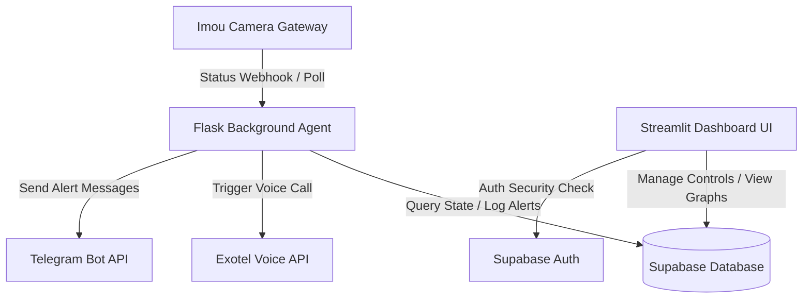

# Imou Camera Status Monitor & Exotel Voice Agent Ecosystem

A hardened, full-stack monitoring ecosystem engineered for security alert reliability, API rate protection, and live visualization controls. This application monitors Imou security cameras using both real-time webhooks and active background polling threads, triggering automated phone calls via the Exotel Voice Platform and Telegram alerts when cameras drop offline.

---

## 🌟 Ecosystem Architecture

The application is refactored into a full-stack, state-free dashboard environment utilizing a decoupled multi-component architecture:



### 1. Flask Daemon Agent (Production Entry: [app.py](file:///C:/Users/rc821/OneDrive/Desktop/imou-exotel-agent/app.py))
- **Active Background Polling**: Monitors device telemetry feeds via the Imou Open API on a default 10-minute cycle (`IMOU_POLL_INTERVAL_SECONDS=600`).
- **Dynamic Database State Checks**: Integrates with [app/lifecycle.py](file:///C:/Users/rc821/OneDrive/Desktop/imou-exotel-agent/app/lifecycle.py) to read and write system pause flags directly to the Supabase database.
- **Webhook Endpoint**: Hosts a blueprint endpoint mapping IoT notifications to safety buffers preventing false alarms.

### 2. Streamlit Dashboard Frontend ([dashboard.py](file:///C:/Users/rc821/OneDrive/Desktop/imou-exotel-agent/dashboard.py))
- **Secure Gateway Checkpoint**: Implements user authentication using the Supabase Auth protocol (`supabase.auth.sign_in_with_password`). No operational data is rendered unless a valid session token is stored in Streamlit local session state.
- **Telemetry Visualizations**: Renders a Plotly-backed bar chart showing daily camera offline counts, alongside interactive metrics showing current state.
- **Master Pause Switch**: A toggle control updating `public.system_state` inside Supabase, immediately honoring commands system-wide.
- **Log Table**: Shows an interactive data table displaying columns for **Device ID**, **Event Type**, **Time Stamp**, and **Exotel/Telegram Dispatched** states.
- **Cloud-Ready Configuration**: Seamlessly supports both local `.env` values and cloud deployment parameters via `streamlit.secrets`.

### 3. Database Layer ([supabase_schema.sql](file:///C:/Users/rc821/OneDrive/Desktop/imou-exotel-agent/supabase_schema.sql))
- **`public.system_state`**: Stores system operational states (`is_paused` and audit timestamps).
- **`public.camera_logs`**: Logs status change histories, device identifiers, and notification confirmations.
- **Database Client Helpers**:
  - [app/supabase_service.py](file:///C:/Users/rc821/OneDrive/Desktop/imou-exotel-agent/app/supabase_service.py): Internal operations service layer using backoff retry wrappers and mock client type check protections.
  - [db_client.py](file:///C:/Users/rc821/OneDrive/Desktop/imou-exotel-agent/db_client.py): Standalone thread-safe client utility for script automation and SQL inserts.

---

## 🛡️ Senior Dev Hardening & Vulnerability Mitigation

This application incorporates explicit structural hardening checkpoints to eliminate edge-case errors:

1. **Failsafe Exponential Backoff Retries**:
   - Both Supabase database operations and Imou API requests are wrapped inside resilient retry routines with exponential backoff.
   - If 3 consecutive connection attempts fail, exceptions are caught cleanly to prevent daemon process crashes.
2. **Expiry-Based Token Caching**:
   - Imou token requests fetch and store the access token in local memory with its exact expiration timestamp, checking `time.time() < self._token_expires_at` on every cycle to eliminate redundant API quota hits.
3. **Strict Anti-Spam Lock**:
   - Implements a global `_last_alert_time` checkpoint enforcing a mandatory **20-minute quiet zone** immediately after any Exotel call executes (succeeds or errors) to protect API wallet credits.
4. **Atomic Execution Validation**:
   - Performs a final runtime check of the `is_paused` state exactly one line of code before invoking the Exotel POST API connection request, completely eliminating race conditions.

---

## 🚀 Getting Started

### 1. Installation & Dependencies Setup
```bash
# Clone or navigate to project directory
cd C:\Users\rc821\OneDrive\Desktop\imou-exotel-agent

# Set up virtual environment
python -m venv .venv
.\.venv\Scripts\Activate.ps1

# Install requirements
pip install -r requirements.txt
```

### 2. Configuration (.env / streamlit/secrets.toml)
Configure your `.env` configuration file in the project root:
```env
# Supabase Parameters
SUPABASE_URL=YOUR_SUPABASE_URL
SUPABASE_KEY=YOUR_SUPABASE_SERVICE_ROLE_KEY

# Exotel Credentials & Lockout
EXOTEL_SUBDOMAIN=api.in.exotel.com
EXOTEL_SID=YOUR_EXOTEL_ACCOUNT_SID
EXOTEL_KEY=YOUR_EXOTEL_API_KEY
EXOTEL_TOKEN=YOUR_EXOTEL_API_TOKEN
FROM_NUMBER=YOUR_PERSONAL_VERIFIED_MOBILE
CALLER_ID=YOUR_EXOPHONE_VIRTUAL_NUMBER
APP_ID=YOUR_EXOTEL_APP_ID
EXOTEL_CALL_LOCKOUT_SECONDS=1800

# Imou OpenAPI Settings
IMOU_APP_ID=YOUR_IMOU_APP_ID
IMOU_APP_SECRET=YOUR_IMOU_APP_SECRET
IMOU_DEVICE_ID=YOUR_IMOU_DEVICE_ID
IMOU_POLL_INTERVAL_SECONDS=600
IMOU_API_BASE_URL=https://openapi.easy4ip.com/openapi

# Telegram Bot Control Plane Credentials
TELEGRAM_BOT_TOKEN=YOUR_TELEGRAM_BOT_TOKEN
TELEGRAM_ALLOWED_CHAT_ID=YOUR_TELEGRAM_ALLOWED_CHAT_ID

# General Settings
BUFFER_DELAY_SECONDS=180
PORT=5000
```

---

## 📊 Database Initialization & Setup

Before running the application, you must scaffold your database tables in the Supabase workspace:
1. Open your project dashboard in the **Supabase Console**.
2. Navigate to the **SQL Editor** tab.
3. Copy the contents of the database setup script [supabase_schema.sql](file:///C:/Users/rc821/OneDrive/Desktop/imou-exotel-agent/supabase_schema.sql) and paste them into the SQL query window.
4. Click **Run** to execute the script. This will create:
   - The `system_state` table (and insert the initial default status row with `id = 1` and `is_paused = FALSE`).
   - The `camera_logs` table (to record camera drop telemetry alerts).

---

## 🏃 Running the Application


### 1. Running the Background Agent (Flask Daemon)
```bash
python app.py
```
This runs the Flask API server and spawns background polling/telegram threads.

### 2. Running the Streamlit Dashboard UI
```bash
streamlit run dashboard.py
```

---

## 🧪 Testing

Run the full automated pytest suite (tests include Supabase mock service verifications, anti-spam quiet zones, and lifecycle operations):
```bash
pytest -v
```
All **28 unit tests** execute in under 3 seconds using local mock dependencies injection.
